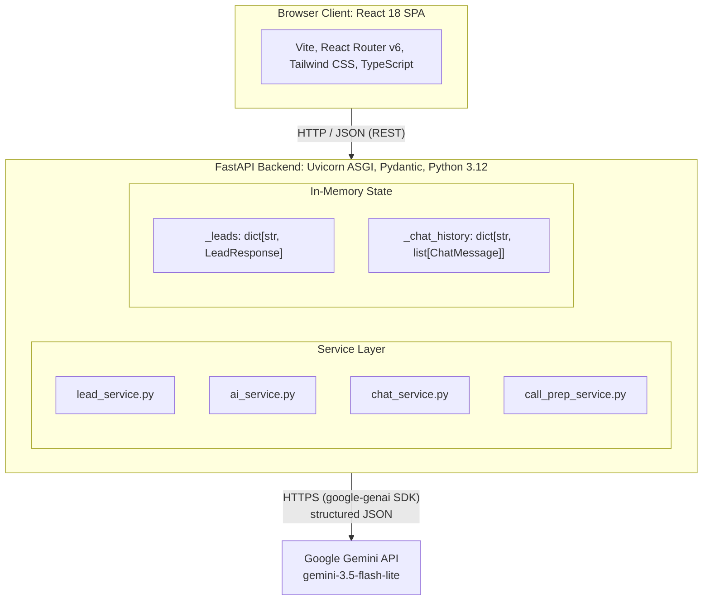
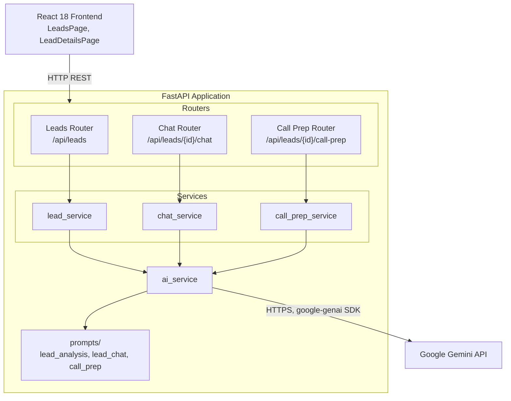
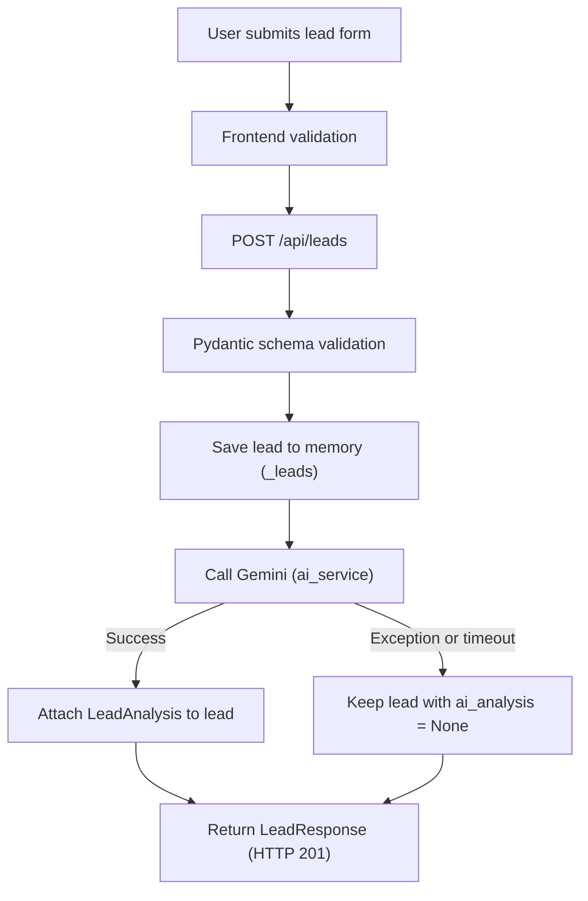
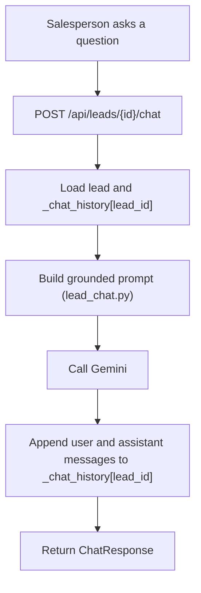
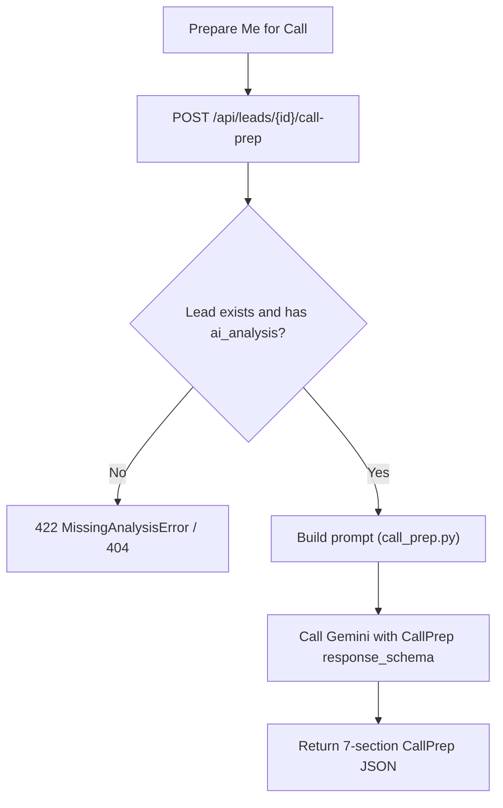
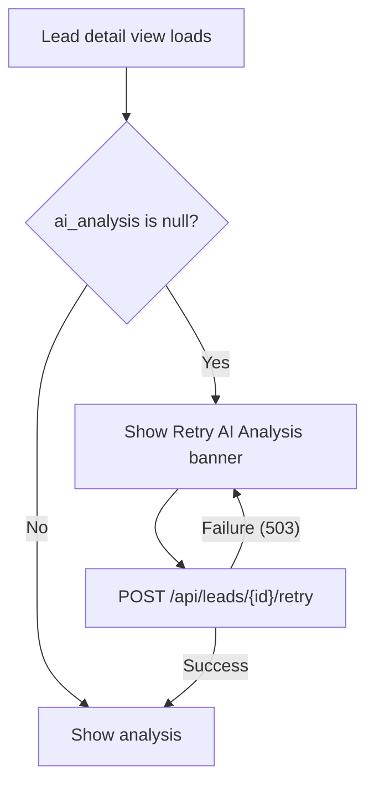
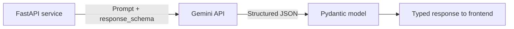
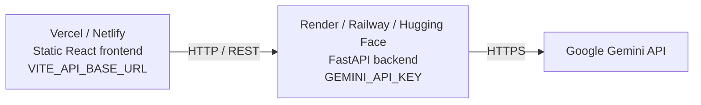

# LeadPilot AI: System Architecture

This document describes how LeadPilot AI is built: components, data flow, AI design, data contracts, and deployment. For product scope and requirements see [`PRD.md`](./PRD.md); for implementation tasks and testing see [`TASK.md`](./TASK.md); for setup see the [README](./README.md).

## Table of Contents

1. [Architecture Overview](#1-architecture-overview)
2. [Technology Stack](#2-technology-stack)
3. [Backend Component Design](#3-backend-component-design)
4. [Workflows](#4-workflows)
5. [AI Architecture](#5-ai-architecture)
6. [Data Model](#6-data-model)
7. [API Reference](#7-api-reference)
8. [Error Handling and Resilience](#8-error-handling-and-resilience)
9. [Security](#9-security)
10. [Deployment Architecture](#10-deployment-architecture)
11. [Design Trade-offs](#11-design-trade-offs)

---

## 1. Architecture Overview

LeadPilot AI is a decoupled client-server application. A React single-page application communicates over REST/JSON with a FastAPI backend, which validates requests, keeps state in memory, and orchestrates calls to the Google Gemini API. The Gemini API key exists only on the backend.

### Design principles

- **Separation of concerns:** routers handle HTTP, services hold business logic, prompt builders own prompt text, and schemas define every contract.
- **Schema-first AI output:** Gemini responses are constrained by Pydantic models, so the UI always receives predictable JSON.
- **Server-side AI orchestration:** the frontend never talks to Gemini directly.
- **Fail safe on data:** a lead is saved before AI analysis runs, so an AI outage never loses customer data.

---

## 2. Technology Stack

| Layer | Technology | Version | Role |
|---|---|---|---|
| Frontend UI | React | 18.3.1 | Component-based UI and reactive state for lead management |
| Frontend language | TypeScript | 5.5.3 | Type safety between frontend models and backend responses |
| Build tool | Vite | 5.4.1 | Fast HMR development and lightweight production builds |
| Styling | Tailwind CSS | 3.4.10 | Utility-first styling and responsive layouts |
| Routing | React Router | 6.26.1 | Client-side routes: `/leads`, `/leads/:id`, `/add-lead` |
| Backend framework | FastAPI | 0.112.2 | Async API with automatic OpenAPI docs |
| Validation | Pydantic | 2.8.2 | Request validation and Gemini `response_schema` definitions |
| ASGI server | Uvicorn | 0.30.6 | Hosts the FastAPI application |
| AI SDK | `google-genai` | 1.5.0 | Official Gemini SDK with structured output support |
| Testing | pytest | 7.4.4 | Backend unit and integration tests |

### Rationale and trade-offs

| Technology | Problem it solves | Trade-off |
|---|---|---|
| **FastAPI** | Removes validation boilerplate; integrates cleanly with async LLM calls | Async calls must be managed carefully to avoid blocking the event loop |
| **React + TypeScript** | Prevents type mismatches between UI and API | Client-side rendering requires explicit loading and error states |
| **Pydantic** | Guarantees LLM output matches the JSON keys the UI expects | Schema changes must be mirrored in TypeScript interfaces |
| **Gemini (`google-genai`)** | Native structured JSON output removes fragile markdown/regex parsing | Requires internet access and valid API credentials |

---

## 3. Backend Component Design

| Module | Responsibility |
|---|---|
| `lead_service.py` | Create, store, retrieve, and sort leads; trigger analysis and retry |
| `ai_service.py` | Single gateway to Gemini; builds requests with `response_schema` |
| `chat_service.py` | Manage per-lead chat history and grounded Q&A |
| `call_prep_service.py` | Enforce prerequisites and generate the call briefing |
| `config.py` | Load settings (`GEMINI_API_KEY`, `GEMINI_MODEL`, `BACKEND_CORS_ORIGINS`) via `pydantic-settings` |
| `prompts/` | Prompt builders for analysis, chat, and call prep |

---

## 4. Workflows

### 4.1 Lead creation and analysis

### 4.2 Contextual chat

Chat history is stored in a dictionary keyed by `lead_id` (`dict[str, list[ChatMessage]]`), so one lead's conversation is never included in another lead's prompt.

### 4.3 AI Call Prep

### 4.4 Retry after network failure

---

## 5. AI Architecture

### 5.1 Request pattern

Analysis and call prep use `response_mime_type="application/json"` with a Pydantic `response_schema` (`LeadAnalysis` or `CallPrep`). Chat returns grounded text.

### 5.2 Prompt builders (`backend/app/prompts/`)

Grounding behavior (no invented facts, no financing assumptions) is defined in [`PRD.md`](./PRD.md) section 8; the table lists what each builder injects and its builder-specific rules.

| Builder | Context injected | Builder-specific rules | Output |
|---|---|---|---|
| `lead_analysis.py` | Name, mobile, email, location, requirement, budget, timeline, message | Distinguish customer objections from missing information; ban unsupported market claims | Six analysis sections, priority score, category |
| `lead_chat.py` | Full lead details, AI analysis, chat history | State that a detail is not available in the lead details instead of inventing it | Grounded text reply |
| `call_prep.py` | Lead details, AI analysis, priority score, chat history | Exactly 3–4 discovery questions; do not re-ask known details | Seven-section `CallPrep` |

`GET /api/leads` returns leads sorted by `priority_score` in descending order. Score ranges and categories are defined in the PRD.

---

## 6. Data Model

| Schema | Purpose | Fields |
|---|---|---|
| `LeadCreate` | Incoming lead payload | `name`, `mobile_number`, `email`, `location`, `property_requirement`, `budget`, `buying_timeline`, `customer_message` |
| `LeadResponse` | Stored lead returned to clients | All `LeadCreate` fields plus `id` (UUID), timestamp, nested `ai_analysis` |
| `LeadAnalysis` | Structured AI analysis | `lead_summary`, `customer_intent`, `key_requirements`, `objections_concerns`, `recommended_next_action`, `suggested_response`, `priority_score` (0–100), `priority` (`HOT` / `WARM` / `COLD`) |
| `ChatMessage` | Single chat entry | `role` (`"user"` or `"model"`), `message`, `timestamp` |
| `ChatRequest` / `ChatResponse` | Chat endpoint payloads | Message in; assistant reply and history out |
| `CallPrep` | Call briefing | `call_objective`, `key_talking_points`, `likely_objection`, `suggested_objection_handling`, `questions_to_ask`, `suggested_opening`, `desired_outcome` |

---

## 7. API Reference

| Method | Endpoint | Module | Purpose | Status codes |
|---|---|---|---|---|
| `GET` | `/` | `app/main.py` | Root status message | 200 |
| `GET` | `/api/health` | `app/api/health.py` | Health check | 200 |
| `GET` | `/api/leads` | `app/api/leads.py` | List leads, priority sorted | 200 |
| `POST` | `/api/leads` | `app/api/leads.py` | Create lead and trigger analysis | 201, 422, 500 |
| `GET` | `/api/leads/{id}` | `app/api/leads.py` | Fetch a single lead | 200, 404 |
| `POST` | `/api/leads/{id}/retry` | `app/api/leads.py` | Retry AI analysis | 200, 404, 503 |
| `GET` | `/api/leads/{id}/chat` | `app/api/chat.py` | Fetch chat history | 200, 404 |
| `POST` | `/api/leads/{id}/chat` | `app/api/chat.py` | Send a message to the lead-scoped assistant | 200, 404, 503 |
| `POST` | `/api/leads/{id}/call-prep` | `app/api/call_prep.py` | Generate the 7-section briefing | 200, 404, 422, 503 |

Interactive documentation is served at `/docs` (OpenAPI).

---

## 8. Error Handling and Resilience

| Condition | Status | Behavior |
|---|---|---|
| Invalid or missing fields (including invalid mobile/email) | 422 | Raised automatically by Pydantic validation |
| Unknown `lead_id` | 404 | Returned by lead lookups |
| Call prep without prior analysis | 422 | `MissingAnalysisError` raised by the call prep service |
| Gemini timeout or API failure | 503 | Caught and reported; on lead creation the lead is saved with `ai_analysis = None` |

### Network interruption and one-click retry

If connectivity drops during intake, the lead is preserved and returned with `201 Created` and no analysis. The lead detail view detects `ai_analysis === null` and shows a **Retry AI Analysis** control that calls `POST /api/leads/{id}/retry` once connectivity returns. This avoids queue infrastructure (Redis, Celery) while ensuring lead data is never lost.

---

## 9. Security

- **Secret isolation:** `GEMINI_API_KEY` is loaded only in `backend/app/config.py` and is never included in API responses, client bundles, or frontend requests.
- **Input validation:** mobile numbers (10–12 digits) and email addresses are validated server-side with regex-backed Pydantic fields.
- **CORS:** `BACKEND_CORS_ORIGINS` restricts browser access to trusted frontend origins.

---

## 10. Deployment Architecture

Planned deployment separates the static frontend from the API service.

---

## 11. Design Trade-offs

| Decision | Benefit | Trade-off and mitigation |
|---|---|---|
| In-memory storage | No database dependency; simple setup; O(1) lookups by UUID | Data resets on restart; planned persistent storage (see Roadmap in the README) |
| Server-side LLM orchestration | Protects API keys and standardizes prompts | One extra network hop between client and Gemini |
| Structured output schemas | Guaranteed JSON shape for UI components | Malformed model output fails validation; handled by Pydantic and error responses |
| Manual one-click retry | User control without queue infrastructure | Requires a user action; mitigated by a clear status banner |
