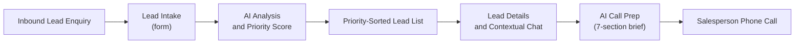

# LeadPilot AI: Product Requirements Document (PRD)

This document defines the product scope, users, requirements, and success criteria for LeadPilot AI. For technical design see [`ARCHITECTURE.md`](./ARCHITECTURE.md); for implementation tasks and testing see [`TASK.md`](./TASK.md); for setup see the [README](./README.md).

## Table of Contents

1. [Product Overview](#1-product-overview)
2. [Problem Statement](#2-problem-statement)
3. [Target User](#3-target-user)
4. [User Workflow](#4-user-workflow)
5. [Product Goals](#5-product-goals)
6. [Functional Requirements](#6-functional-requirements)
7. [Custom Feature: AI Call Prep](#7-custom-feature-ai-call-prep)
8. [AI Behavior Principles](#8-ai-behavior-principles)
9. [Non-Goals](#9-non-goals)
10. [Known Limitations](#10-known-limitations)
11. [Product Decisions](#11-product-decisions)
12. [Success Criteria](#12-success-criteria)

---

## 1. Product Overview

LeadPilot AI is an AI-powered lead intelligence assistant for real-estate salespeople. It turns raw inbound enquiries into prioritized, actionable sales opportunities.

Real-estate sales professionals receive a high volume of inbound enquiries every day. They spend significant time reading unstructured messages, judging buyer intent, deciding whom to contact first, and preparing for calls without consolidated context.

LeadPilot AI captures each lead and processes it with Google Gemini. Instead of generic summaries, it extracts customer intent, key requirements, explicit objections, a recommended next action, and a 0–100 priority score (`HOT` / `WARM` / `COLD`).

It then supports the rest of the sales cycle with two tools:

- A **lead-isolated contextual AI assistant** for follow-up questions about a specific lead.
- An **AI Call Prep** generator that produces a 7-section briefing before a phone call.

Throughout, the AI is constrained to the facts in the lead record and never invents missing details.

---

## 2. Problem Statement

| # | Challenge | Impact |
|---|---|---|
| 1 | **High inbound volume** | Dozens of enquiries arrive daily across web forms and portals; manual review is slow and error-prone. |
| 2 | **Poor prioritization** | Unstructured forms do not surface urgent buyers, so low-intent leads get called while high-budget, immediate buyers wait. |
| 3 | **Missing context** | Representatives must piece together location, budget, timeline, and requirements from free-text notes. |
| 4 | **Call preparation effort** | Talking points, objection handling, and discovery questions are time-consuming to build for every lead. |
| 5 | **AI hallucination** | General-purpose LLM tools often invent details such as family size or financing status, leading to wrong assumptions on calls. |

---

## 3. Target User

**Primary persona:** real-estate salesperson, account executive, or property advisor.

**Responsibilities:** receives inbound enquiries for residential and commercial properties, qualifies buyers, conducts discovery calls, schedules site visits, and manages client relationships.

**Questions the product must answer:**

- Which lead should I call first right now?
- What does this customer want, and what are their budget and timeline?
- What objections should I expect on the call?
- What should I ask to fill in the missing requirements?

---

## 4. User Workflow

1. **Lead intake:** the salesperson enters a lead through a structured 8-field form: name, mobile, email, location, property requirement, budget, timeline, message.
2. **AI analysis and scoring:** the lead is analyzed and receives a breakdown and a 0–100 priority score.
3. **Prioritized list:** leads are sorted by score, descending.
4. **Lead details and chat:** the salesperson opens a lead to review details and ask lead-isolated follow-up questions.
5. **Call prep:** **Prepare Me for Call** generates the 7-section brief immediately before dialing.

---

## 5. Product Goals

| Goal | Description |
|---|---|
| **Faster lead evaluation** | A representative can scan intent, budget, timeline, and key requirements in under 10 seconds. |
| **Dynamic prioritization** | All incoming leads are ranked by AI-computed urgency so high-intent buyers are handled first. |
| **Grounded AI** | The AI states when information is missing rather than fabricating customer facts. |
| **One-click call readiness** | A structured brief provides a tailored opening, talking points, objection responses, and discovery questions. |

---

## 6. Functional Requirements

### 6.1 Lead Intake

| Field | Required | Validation |
|---|---|---|
| Name | Yes | Non-empty |
| Location | Yes | Non-empty |
| Property requirement | Yes | Non-empty |
| Budget | Yes | Non-empty |
| Buying timeline | Yes | Non-empty |
| Customer message | Yes | Non-empty |
| Mobile number | Yes | Indian format, 10–12 digits |
| Email address | No | Standard email format |

Mobile number and email are additions beyond the base assignment fields.

### 6.2 AI Analysis

Every captured lead receives six outputs:

1. **Lead Summary:** high-level overview of the buyer.
2. **Customer Intent:** primary purchase or investment goal.
3. **Key Requirements:** extracted preferences as bullet points.
4. **Objections / Concerns:** explicit hesitations or gaps.
5. **Recommended Next Action:** the representative's next step.
6. **Suggested Response:** a draft reply to the customer.

### 6.3 Conversational AI Assistant

- The salesperson can ask free-text questions about a selected lead.
- Conversation history is kept separately for each lead.
- Answers use only that lead's data and conversation.

### 6.4 Lead Prioritization

The priority score is an integer from 0 to 100 based on budget clarity, timeline urgency, and requirement specificity.

| Category | Range | Typical profile |
|---|---|---|
| `HOT` | 80–100 | Immediate timeline, clear budget, high intent |
| `WARM` | 50–79 | Moderate timeline, reasonable requirements |
| `COLD` | 0–49 | Long timeline, vague requirements, low intent |

The lead list is sorted by score, descending.

### 6.5 Display and Visual Scanning

- Color-coded priority badges: red (`HOT`), amber (`WARM`), slate (`COLD`).
- Score progress bars from 0 to 100.
- Clear grouping of contact details, property requirements, AI analysis, call prep, and chat on the lead detail view.

---

<<<<<<< HEAD
## 7. Custom Feature: AI Call Prep

**Problem:** representatives lose time assembling talking points and anticipating objections before each call.

**Solution:** a one-click **Prepare Me for Call** action that generates a structured brief grounded in the lead details, existing AI analysis, priority score, and chat history.

| # | Section | Description |
|---|---|---|
| 1 | Call Objective | Single-sentence goal for the call |
| 2 | Key Talking Points | 3–6 points referencing the lead's actual requirements |
| 3 | Likely Objection | Most probable concern, grounded in the enquiry |
| 4 | Suggested Objection Handling | Strategy for addressing that objection |
| 5 | Questions to Ask | Exactly 3–4 natural discovery questions for missing information |
| 6 | Suggested Opening | Professional, conversational opening line |
| 7 | Desired Outcome | Specific target result by the end of the call |
=======
## 7. Custom Signature Features

### 7.1 AI Call Prep
- **Problem**: Sales representatives lose productivity assembling talking points and anticipating objections prior to calling a buyer.
- **Solution**: A 1-click **"Prepare Me for Call"** feature generating a structured 7-section call brief grounded in lead details, past AI analysis, priority score, and chat history.

#### The 7 Call Prep Sections:
1. **Call Objective**: Single-sentence goal for the phone call.
2. **Key Talking Points**: 3–6 concise points referencing actual lead requirements.
3. **Likely Objection**: Most probable customer concern grounded in the enquiry.
4. **Suggested Objection Handling**: Clear strategy to handle the objection.
5. **Questions to Ask**: Exactly 3–4 natural-language discovery questions targeting missing info.
6. **Suggested Opening**: Professional conversational opening line.
7. **Desired Outcome**: Specific targeted outcome by the end of the call.
>>>>>>> 5a378ed (Add AI multi-channel outreach studio)

### 7.2 AI Multi-Channel Outreach Studio
- **Problem**: After reviewing lead insights, sales representatives waste time manually drafting outreach text for WhatsApp, Email, or SMS across different customer personas.
- **Solution**: A dedicated **AI Outreach Studio** that instantly generates customized messaging across 4 channels (**WhatsApp**, **Email**, **SMS**, **Strategy Notes**) with 4 dynamic tone options (*Consultative*, *High Urgency*, *Friendly & Warm*, *Executive*).
- **Protocol Action Triggers**: Includes 1-click **Send via WhatsApp** (`api.whatsapp.com` / `wa.me`), **Open Email Client** (`mailto:`), **Send SMS** (`sms:`), and **Copy to Clipboard**.

---

## 8. AI Behavior Principles

- **Strict grounding:** the AI relies only on facts present in the lead record or chat history.
- **Information gaps:** when asked for unstated details (for example, a preferred micro-locality or financing), the AI states that the information is not available in the lead details instead of inventing values.
- **No financing assumptions:** the AI does not assume the customer needs a home loan unless they say so.
- **Context isolation:** conversations for one lead are never used for another lead.

---

## 9. Non-Goals

The following are intentionally out of scope:

- Relational database persistence (in-memory storage is used)
- User authentication, multi-tenant roles, or access control
- Automated outbound SMS, WhatsApp, or voice calling
- MLS or property inventory search
- Third-party CRM synchronization (HubSpot, Salesforce)

---

## 10. Known Limitations

- **Data volatility:** leads and chat history reset when the backend restarts.
- **AI service dependency:** analysis, chat, and call prep need internet access and a valid Gemini API key.
- **Call Prep prerequisite:** a lead must have a successful AI analysis before a brief can be generated.

---

## 11. Product Decisions

| Decision | Rationale |
|---|---|
| Lead-isolated chat | Prevents context leakage between buyers; history is limited to the current session per lead |
| Save the lead even if AI analysis fails, with one-click retry | Customer data is never lost to an AI outage |

---

## 12. Success Criteria

- A salesperson can create leads with validated contact details.
- Every lead receives a 6-point AI analysis and a 0–100 priority score.
- Leads are automatically ranked by score in the lead list.
- A salesperson can ask contextual questions and receive grounded answers without hallucinated details.
- A salesperson can generate a 7-section AI Call Prep brief on demand.
