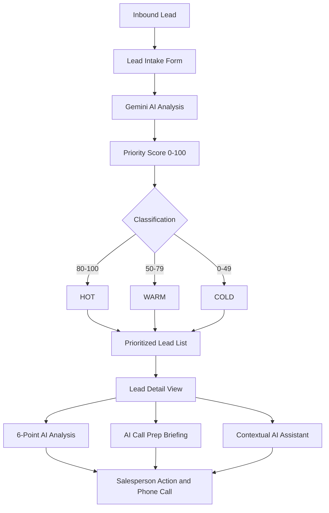
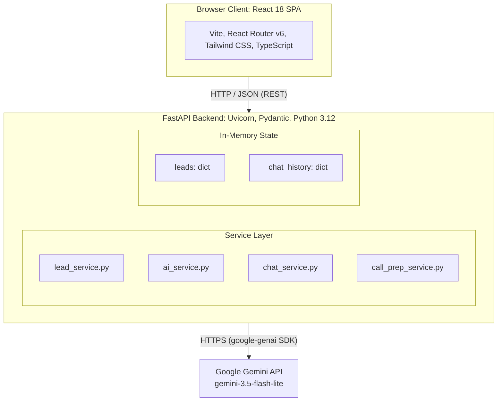

<div align="center">

# LeadPilot AI

**AI-powered real-estate lead prioritization and sales assistant.**

Turn raw inbound enquiries into structured sales intelligence, priority scores, and call-ready briefings.


[Live Demo](YOUR_LIVE_URL_HERE) · [GitHub Repository](YOUR_GITHUB_REPOSITORY_URL) · [API Docs](http://localhost:8000/docs)

</div>

---

## Table of Contents

1. [Overview](#1-overview)
2. [Features](#2-features)
3. [Signature Feature: AI Call Prep](#3-signature-feature-ai-call-prep)
4. [Architecture](#4-architecture)
5. [Gemini Integration](#5-gemini-integration)
6. [AI Grounding and Anti-Hallucination](#6-ai-grounding-and-anti-hallucination)
7. [Resilience: Network Interruption Handling](#7-resilience-network-interruption-handling)
8. [Technical Decisions](#8-technical-decisions)
9. [Getting Started](#9-getting-started)
10. [Testing and Verification](#10-testing-and-verification)
11. [Known Limitations](#11-known-limitations)
12. [Roadmap](#12-roadmap)
13. [AI Tooling Disclosure](#13-ai-tooling-disclosure)

---

## 1. Overview

### Problem

A real-estate salesperson receives multiple inbound property enquiries every day through web forms, email, and messaging apps. Evaluating them manually is slow and leads to delayed responses. For each lead, the salesperson needs to know:

- What the customer wants (property type, size, location)
- Budget and buying timeline
- Intent: end-use homebuyer or investor
- Explicit concerns or objections
- Which leads need urgent attention
- What action to take next

### Solution

LeadPilot AI converts raw enquiry text into structured, AI-generated sales intelligence. It scores and ranks every lead so representatives can focus on high-intent buyers first, and it prepares them for each call with a tailored briefing.

### Workflow



---

## 2. Features

| Feature | Details |
|---|---|
| **Multiple lead storage** | In-memory store (`_leads: dict[str, LeadResponse]`) supporting many leads at once. |
| **Dynamic priority scoring** | `priority_score` (0–100) computed by Gemini from budget clarity, timeline urgency, and requirement specificity. |
| **Priority categories** | `HOT` (80–100), `WARM` (50–79), `COLD` (0–49). |
| **Pre-sorted lead list** | `GET /api/leads` returns leads sorted by `priority_score`, highest first. |
| **Filtering and search** | Client-side filter pills (`ALL`, `HOT`, `WARM`, `COLD`), text search, and multi-criteria sorting. |
| **6-part AI analysis** | Lead Summary, Customer Intent, Key Requirements, Objections/Concerns, Recommended Next Action, Suggested Response. |
| **Contextual AI assistant** | Grounded Q&A chat, isolated per lead ID. |
| **AI Call Prep** | One-click 7-section call briefing (see below). |
| **Network resilience** | Lead data is preserved if the AI is unreachable, with a one-click retry endpoint. |

---

## 3. Signature Feature: AI Call Prep

Before dialing, representatives usually re-read notes and guess at likely objections. The **Prepare Me for Call** action generates a structured 7-section briefing for the selected lead in about two seconds:

| # | Section | Description |
|---|---|---|
| 1 | Call Objective | One-sentence primary goal for the call. |
| 2 | Key Talking Points | 3–6 points tied to the customer's actual requirements. |
| 3 | Likely Objection | Probable pushback, grounded in the customer's message. |
| 4 | Objection Handling Strategy | Tactical approach to resolve that objection. |
| 5 | Questions to Ask | 3–4 natural discovery questions to fill in missing details. |
| 6 | Suggested Opening Line | Personalized greeting using lead context. |
| 7 | Desired Call Outcome | Specific target result by the end of the call. |

Endpoint: `POST /api/leads/{id}/call-prep` (requires existing AI analysis on the lead).

---

## 4. Architecture



### Request Lifecycle

1. **Intake:** the client submits a lead via `POST /api/leads`. Pydantic validates the payload (mobile number: 10–12 digits; email format).
2. **Persistence:** the lead is stored in the in-memory `_leads` dictionary.
3. **AI orchestration:** `ai_service.py` builds a grounded prompt and calls `client.models.generate_content` with `response_schema=LeadAnalysis`.
4. **Ranking:** the structured output (`priority_score`, `priority`, and the six analysis fields) is attached to the lead.
5. **Retrieval:** `GET /api/leads` sorts by `priority_score` descending.
6. **Contextual operations:**
   - `POST /api/leads/{id}/chat` loads history from `_chat_history[lead_id]`, sends the full grounded context to Gemini, and appends the new messages.
   - `POST /api/leads/{id}/call-prep` verifies analysis exists, then returns the 7-section briefing.

### API Summary

| Method | Endpoint | Purpose |
|---|---|---|
| `POST` | `/api/leads` | Create a lead and run AI analysis |
| `GET` | `/api/leads` | List leads sorted by priority score |
| `POST` | `/api/leads/{id}/retry` | Retry AI analysis for a lead |
| `POST` | `/api/leads/{id}/chat` | Ask the lead-scoped AI assistant |
| `POST` | `/api/leads/{id}/call-prep` | Generate the call preparation briefing |

---

## 5. Gemini Integration

- **Official SDK:** built on Google's `google-genai` Python SDK (`google.genai`).
- **Model:** defaults to `gemini-3.5-flash-lite`, configurable through the `GEMINI_MODEL` environment variable.
- **Native structured output:** uses `response_mime_type="application/json"` with Pydantic `response_schema` definitions (`LeadAnalysis`, `CallPrep`). Responses conform to backend schemas without regex or markdown parsing.
- **Server-side key isolation:** `GEMINI_API_KEY` is loaded only on the backend via `pydantic-settings` (`backend/app/config.py`). It is never returned in API responses or included in frontend bundles.

---

## 6. AI Grounding and Anti-Hallucination

Prompt rules in `backend/app/prompts/` reduce fabricated details and prevent cross-lead contamination:

1. **Information gaps:** when data is missing (for example, loan status or location preference), the model must state *"Information not available in lead details"* rather than invent facts.
2. **No financial assumptions:** a home loan is never assumed unless the customer mentions it.
3. **Context isolation:** chat history is keyed by lead UUID (`_chat_history[lead_id]`); one lead's conversation is never included in another lead's prompt.
4. **Grounded prompts:** every chat and call-prep request injects the raw lead fields and the existing analysis.

---

## 7. Resilience: Network Interruption Handling

If connectivity drops or the Gemini API times out during lead creation:

1. **Data preservation:** the raw lead is still stored (`ai_analysis = None`) and the API returns `201 Created`.
2. **One-click retry:** the lead detail view detects the missing analysis and shows a **Retry AI Analysis** banner, which calls `POST /api/leads/{id}/retry` once connectivity returns.

---

## 8. Technical Decisions

| Area | Choice | Alternative | Rationale |
|---|---|---|---|
| Backend | FastAPI | Django, Flask | Async performance, automatic OpenAPI docs, native Pydantic validation aligned with the Gemini SDK. |
| Frontend | React, TypeScript, Vite | Next.js, vanilla JS | Fast dev loop, lightweight SPA, strict type alignment with backend models. |
| Storage | In-memory | PostgreSQL, SQLite | No database dependency for quick evaluation; O(1) lookups by lead UUID. |
| AI output | Pydantic `response_schema` | Free-text parsing | Deterministic JSON keys for UI components; avoids rendering errors. |
| Resilience | Decoupled one-click retry | Background task queue | No Redis/Celery needed while still protecting lead data during outages. |

---

## 9. Getting Started

### Prerequisites

- Python 3.10+
- Node.js 18+ and npm
- A Google Gemini API key ([Google AI Studio](https://aistudio.google.com/))

### Backend

```bash
cd backend
python -m venv .venv

# Windows (PowerShell)
.\.venv\Scripts\Activate.ps1
# macOS / Linux
source .venv/bin/activate

pip install -r requirements.txt
```

Create `backend/.env`:

```env
APP_NAME="LeadPilot AI"
ENVIRONMENT="development"
BACKEND_CORS_ORIGINS="http://localhost:5173"
GEMINI_API_KEY="YOUR_GEMINI_API_KEY_HERE"
GEMINI_MODEL="gemini-3.5-flash-lite"
```

Start the server:

```bash
uvicorn app.main:app --reload --port 8000
```

Interactive API docs: <http://localhost:8000/docs>

### Frontend

```bash
cd frontend
npm install
```

Create `frontend/.env`:

```env
VITE_API_BASE_URL="http://localhost:8000"
```

Start the dev server:

```bash
npm run dev
```

Application: <http://localhost:5173>

---

## 10. Testing and Verification

### Backend unit tests (47 passing)

```bash
python -m pytest backend/app/tests -v
```

| Test file | Coverage |
|---|---|
| `test_call_prep.py` | 7-section Pydantic payload parsing and `MissingAnalysisError` guard |
| `test_contact_info.py` | Indian phone number regex, optional email format, backward compatibility |
| `test_lead_analysis_schema.py` | Score bounds (0–100) and strict `HOT`/`WARM`/`COLD` enum values |

```text
============================= 47 passed in 1.13s ==============================
```

### Live end-to-end test

Runs against a live Uvicorn server and the Gemini API:

```bash
python backend/app/tests/test_e2e_live.py
```

### Frontend production build

```bash
cd frontend
npm run build
```

`tsc -b && vite build` completes with 0 errors.

---

## 11. Known Limitations

- **Volatile storage:** leads and chat history live in memory and are lost when the server restarts.
- **Network dependency:** analysis, chat, and call prep need internet access and valid Gemini credentials.
- **Call Prep prerequisite:** a lead must already have AI analysis (`ai_analysis !== null`) before a briefing can be generated.

---
### 8. AI Multi-Channel Outreach Studio

LeadPilot also provides an AI-powered outreach generation feature that converts
lead context and existing AI analysis into personalized communication content.

The feature is intentionally **generation-only**. It does not send WhatsApp
messages, emails, or make calls. The salesperson reviews the generated content
and can copy it for manual use.

#### Supported Outreach Formats

1. **WhatsApp Message**
   - Generates a concise, personalized WhatsApp message.
   - Uses the lead's requirements, budget, timeline, and concerns.

2. **Email**
   - Generates a personalized email subject and body.
   - Tailored to the specific lead context.

3. **Call Opening Script**
   - Generates a natural opening script for the salesperson's call.
   - Helps the salesperson start the conversation with relevant context.

4. **Follow-up Message**
   - Generates a follow-up message based on the lead's current context
     and recommended next action.

#### Outreach Workflow

```text
Lead Context
     ↓
Existing AI Analysis
     ↓
AI Multi-Channel Outreach Studio
     ↓
┌─────────────────┬─────────────────┬──────────────────┐
│ WhatsApp        │ Email           │ Call Opening     │
│ Message         │ Subject + Body  │ Script           │
└─────────────────┴─────────────────┴──────────────────┘
     ↓
Salesperson Reviews
     ↓
Copy & Use Manually

## 12. Future Improvement

- **Persistent storage:** PostgreSQL or SQLite via SQLAlchemy.
- **Authentication and RBAC:** multi-user JWT auth so managers can assign leads to representatives.
- **Channel integrations:** WhatsApp webhooks and SMS triggers for automated first responses.
- **CRM sync:** two-way synchronization with HubSpot or Salesforce.

---

## 13. AI Tooling Disclosure

AI assistance was used during development as a development and reasoning aid.

* **ChatGPT** — Used for architecture discussions, understanding system design and technical trade-offs, prompt design, debugging, and reasoning through implementation decisions.
* **Claude** — Used for presentation and documentation support, including creating and structuring the **ARCHITECTURE.md, TASK.md, PRD.md, and README.md** files.

All architectural decisions, prompt design rules, state isolation logic, and custom feature implementations were reviewed, verified, and tested during development. The final implementation was validated to ensure that the system behavior and technical decisions were understood and consistent with the project requirements.

